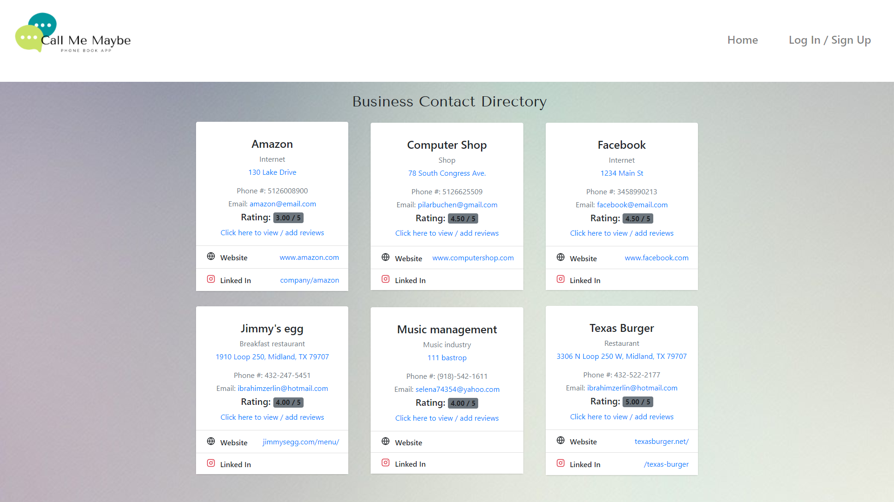

# Call Me Maybe

#### Table of Contents
* [App-Screenshot](#App-Screenshot)
* [Project Description](#Project-Description)
* [Installation](#Installation)
* [Usage](#Usage)
* [Contributors](#Contributors)

 ## App-Screenshot

  

## Project-Description

Our team wanted to store all of our personal contacts information, advertise businesses, and a place for the public to leave reviews and ratings to the businesses we all interact with regularly. Our phonebook application will allow you to store your contacts, and it will enable your business to be visible to the public. You will receive email notifications for the reviews and ratings of your business. 

## Installation
* No installation needed.

## Usage
* Allows for users to view and post public contact information for businesses as well as create private contact informations for individuals.

## Contributors
* Ibrahim Zerlin
* Pilar Buchen
* Sharee Osborn
* Cooper Cutbirth

## Link to Deployed Site

Please visit our page: https://call-me-maybe-gp2.herokuapp.com/

